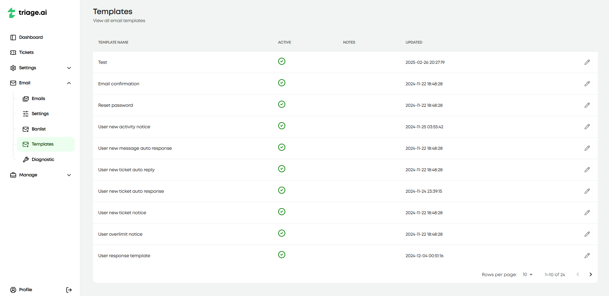

Email Templates
===============

triage.ai uses predefined templates when sending out auto-responses, notices, and alerts. Templates cannot be added or deleted as they are explicitly designed to deal with any expected scenarios where email communication will come up.
However, the templates can be customized, and support for variables to be used within the emails is expected soon. It is strongly advised not to edit the templates for email confirmation, reset password, and guest email ticket confirmation, as these emails
do expect a variable input within the template.

