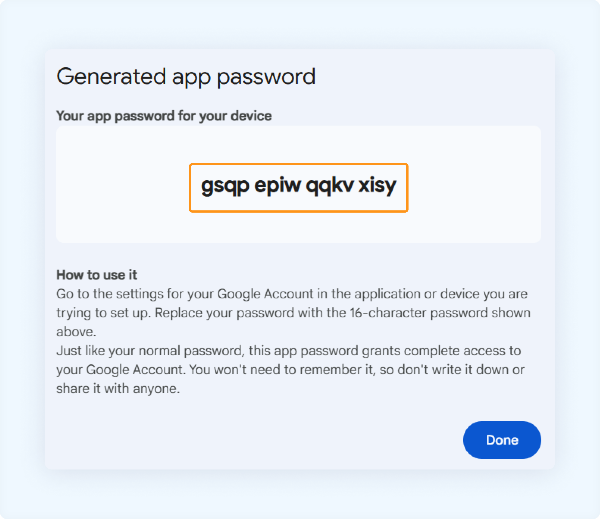

IMAP Settings Guide
========================

triage.ai will poll from any registered external IMAP accounts regularly, retrieve email messages, and convert them to tickets. This feature can be enabled from the email tab available to admins. 

Registering an Email/Enabling IMAP
-----------------------------------

Every email registered within triage.ai will require an SMTP server and setting up an app password with your email provider. Before adding the email to the system for polling, users should ensure that IMAP is enabled
in their account settings. This will usually be found under forwarding or an actual IMAP/POP tab and must be turned on if not already on.

**App Passwords**

Most modern email services no longer allow for less secure app access. Users must generate an app password to enable SMTP and IMAP functionality. 
You can find this in your email provider's security settings. Before generating the app password, you must enable 2FA on your email account. Once 2FA is enabled,
there will be an option to create an app password. It is recommended that you label this app password as something related to triage.ai so you can quickly identify it if you need to revoke the app password.

You will also be required to provide the SMTP server for your email provider and ensure they comply with TLS connections. Most modern email services do, and it is easy to verify if the one you'd like to use does support it.
If you wish to enable IMAP polling, you must also provide the IMAP server for your email provider. The SMTP and IMAP servers can be found in your email provider's documentation or on the Internet.
This feature is best supported by Gmail but also works with Yahoo, AOL, and iCloud mail. Support for Outlook and other email providers is expected soon.

Schedule Polling
----------------

triage.ai will poll from any registered external IMAP accounts every 5 minutes by default. This can be adjusted within the file main.py in the backend folder. It is recommended not to poll more frequently than every 5 minutes as this can cause performance issues with the system, but 
this can be changed to poll less frequently if desired. If you wish to change the polling frequency, you will need to adjust the following line in main.py:

.. code-block:: python

 scheduler.add_job(func=create_imap_server, trigger='cron', args=[db, background_task, s3_client], minute='*/5')

You can adjust the minute='*/5' to any other value to change the polling frequency. For example, if you wanted to poll every 10 minutes, you would change it to minute='*/10'.

Right above that line of code is also the scheduled task to check if any tickets are overdue and can be changed the same way if desired.

