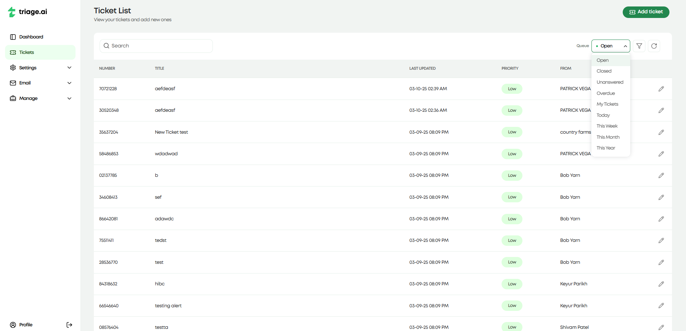

Ticket Guide
=================
Tickets are the core component of triage.ai's customer support system. They represent customer inquiries, requests, or issues that require resolution by support agents. Agents can create tickets on behalf of the user or by the users themselves. This guide will provide an overview of the various features available when working with tickets and instructions on how to use them.

Ticket Dashboard
----------------
The ticket dashboard is the first page you will see when you log in as an agent. This dashboard is the central hub for all ticket-related activities.
The dashboard lists all the tickets within the system, with the ability to search, filter, and edit any available tickets. The dashboard gives an essential preview of each ticket, 
including the ticket number, title, priority, last update, and the user attached to the ticket. 

**Ticket Search/Filtering**

Agents can search for tickets in the dashboard by ticket number and title, applying ticket queues, or using the advanced search feature. Ticket queues are additional categories that 
help filter tickets based on predefined criteria. Some of the ticket queues triage.ai provides by default are: 

 #. Open Tickets
 #. Closed Tickets
 #. Overdue Tickets
 #. Created Today

...and several more. You can visit the :doc:`Manage Pages Guide<Manage Pages>` for more information on ticket queues and how to add custom ones. 

triage.ai also provides an advanced search feature that lets you filter tickets on all fields available in the ticket. It includes a filter tab that enables you to select from what ticket fields you
would like to search on, a sorting tab that will let you decide how you'd want to sort the numerical fields of the tickets, and a columns tab that enables you to customize the
ticket dashboard to display the columns you would like to see in the ticket list. These filtering options go a long way to helping agents manage their tickets effectively.
The images below list some examples of what the advanced search looks like in action.

**Ticket Creation**

To create a new ticket:

1. Navigate to the **Ticket Dashboard**.
2. Click on the **"Add Ticket"** button.
3. Fill in the required fields:

 - **User**: The customer associated with the ticket.
 - **Topic**: The category that best describes the target issue.
 - **Title**: A short, descriptive name for the issue.
 - **Description**: A detailed explanation of the issue.
 - **Form Entries**: Additional information required by the form linked to the topic.

4. Fill in any extra optional fields that may be relevant to the ticket but are not required to create one. This will include
 
 - **Agent**: The agent assigned to the ticket.
 - **Department**: The department to which the ticket will be assigned.
 - **SLA**: The grace period given to the ticket if no due date is assigned
 - **Status**: The current status of the ticket.
 - **Priority**: The importance of the ticket.
 - **Due Date**: The date the ticket is expected to be resolved.

 Not providing these fields will default them to the system default set in the ticket settings under the settings tab.

5. Click **"Create Ticket"** to create the ticket. The appropriate emails regarding the ticket's creation will be sent to agents and users. It will then appear in the ticket dashboard for tracking and management.

**Ticket Editing**

To edit an existing ticket:

1. Locate the ticket in the **Ticket Dashboard** using search or filters.
2. Click on the ticket to open it, then select the pencil icon/Click the pencil icon next to the ticket.
3. Modify the necessary fields.
4. Click **"Save"** to update the ticket.

This will also send proper email updates to the users and agents involved in the ticket. Both processes above apply to the fully registered users, but they will not see all the internal fields shown for agents. Guests will have their own dashboard, which we will cover shortly.

.. image:: ../_static/ticket_edit.PNG
   :alt: Photo of advanced ticket editing

Ticket Modal
----------------
The Ticket Modal provides a detailed view of a ticket, including essential ticket information and the associated conversation thread. 
This modal appears when selecting a ticket from the dashboard and offers a streamlined way to manage interactions and track progress.
The modal offers two important tabs: the details tab and the thread tab. The details tab displays relevant ticket information to the agent and the user.
The images below show the detail tab for the same ticket for both the agent and the user.

The thread tab offers a history of all interactions made with the ticket for both the agent and the user but also provides the ability to message between the two parties.
This messaging includes a rich text editor that lets agents and users format their messages and the ability to attach files to the ticket if the S3 plugin is configured. If the user who created the ticket
did it through email, the email address responsible for generating that ticket would be used to respond to the user's email to turn the ticket thread's messaging into
an email thread for that user. The image below shows the thread with some messages between the agent and the user and interactions made with the ticket.

Guest Tickets
------------------------
Guests will go through a separate dashboard and creation process (if they are using the site and are not sending an email to a polling email address). For guests, the ticket
The creation process will request the same information the registered users would provide, along with their name and email address, so they can register as guests if they haven't already done so. 

Guests should expect to receive an email with their ticket number and a link that will take them back to the site and allow them to view their ticket. Inputting their email and ticket number will let them view the guest ticket dashboard 
with that respective ticket. 

The guest dashboard will display the same information as the user ticket dashboard, provide an option to edit their ticket and allow the ticket thread to
communicate with the agent. This access will have a short expiry time (~15 minutes), in which refreshing the page after this time will require the guest to input their email and ticket number again to view the ticket.
The image below shows the guest ticket dashboard with a ticket created by a guest and the thread tab open to show the messages between the agent and the guest.

